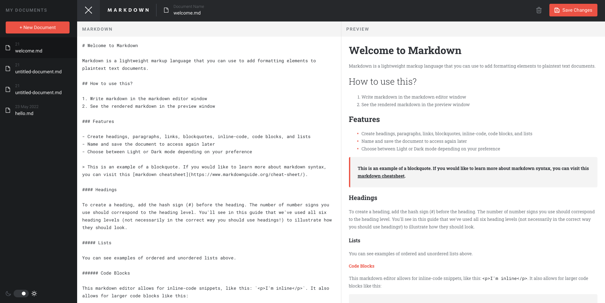

# Frontend Mentor - In-browser markdown editor solution

This is a solution to the [In-browser markdown editor challenge on Frontend Mentor](https://www.frontendmentor.io/challenges/inbrowser-markdown-editor-r16TrrQX9). Frontend Mentor challenges help you improve your coding skills by building realistic projects. 

## Table of contents

- [Overview](#overview)
  - [The challenge](#the-challenge)
  - [Screenshot](#screenshot)
  - [Links](#links)
- [My process](#my-process)
  - [Built with](#built-with)
  - [What I learned](#what-i-learned)
  - [Continued development](#continued-development)
- [Author](#author)

## Overview

### The challenge

Users should be able to:

- Create, Read, Update, and Delete markdown documents
- Name and save documents to be accessed as needed
- Edit the markdown of a document and see the formatted preview of the content
- View a full-page preview of the formatted content
- View the optimal layout for the app depending on their device's screen size
- See hover states for all interactive elements on the page
- **Bonus**: If you're building a purely front-end project, use localStorage to save the current state in the browser that persists when the browser is refreshed

### Screenshot



### Links

- Live Site URL: [In Browser Markdown Editor](https://nekopudding.github.io/in-browser-markdown-editor/)

## My process

### Built with

- Semantic HTML5 markup
- CSS custom properties
- Desktop-first workflow
- [React](https://reactjs.org/) - JS library
- [MUI](https://mui.com/) - Components library for react
- [React Mardown](https://github.com/remarkjs/react-markdown) - converts markdown string into html elements for markdown preview

### What I learned
- vertical align using display flex and align item center
- setting hover color of icon using the fill attribute
(Header.jsx)
```js
"&:hover *": { fill: theme.palette.primary.main }
```
- [changing border color of input field](https://stackoverflow.com/questions/52911169/how-to-change-the-border-color-of-mui-textfield) 
- [customizing bullet points](https://www.w3schools.com/howto/howto_css_bullet_color.asp) (Editor.jsx)
 ```js 
'& ul': {listStyle: 'none',position: 'relative',},
'& ul li::before': {
  content: '"\\2022"',  //unicode for a bullet
  fontFamily: 'Roboto Slab', 
  color: _.primary.main, 
  position: 'absolute',
  fontWeight: 900, 
  display: 'inline-block', 
  width: '1em', 
  ml: '-1em', 
},
 ```
- position relative is useful to setting the parent of position absolute and may be required in certain cases for setting overflow to hidden
- parsing data to be stored in localStorage
```js
localStorage.setItem("files",JSON.stringify(updatedList));
const files = JSON.parse(localStorage.getItem("files"));
```
- using resize listener to update layout to the current window dimensions

- filtering out pre-defined props in react composition using for loop (EditorHeader.jsx)
```js
let filteredProps = {};
  for (const p in props) { 
    if (p !== "darkMode")
      filteredProps[p] = props[p]
  }
```

 - disabling hover effects for touch devices
 ```js
 export default function isTouchDevice() {
  return (('ontouchstart' in window) ||
     (navigator.maxTouchPoints > 0) ||
     (navigator.msMaxTouchPoints > 0));
}
 ```

### Continued development

I will focus on refactoring components and the planning aspect of designing my code in order to make my future development processes more structurally organized.

## Author

- Website - [Dean Yang](https://nekopudding.github.io/portfolio/)
- Frontend Mentor - [@nekopudding](https://www.frontendmentor.io/profile/nekopudding)

